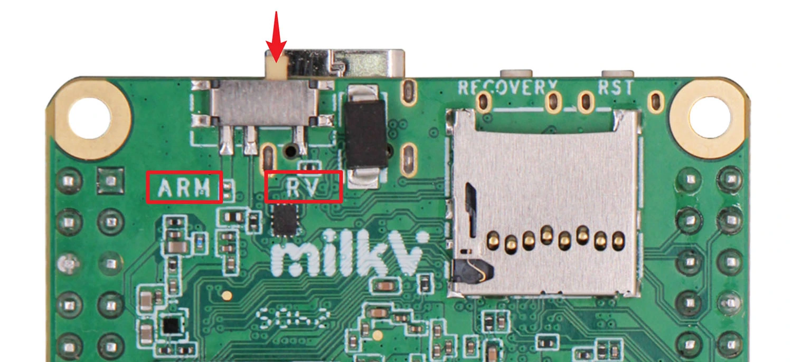

## Choosing the Primary Core: ARM or RISC-V

{fig-align=center height=420px}

::: {.fragment}
The Duo S carries an SG2000, whose primary core can be either a **RISC-V
C906** or an **ARM Cortex-A53**, selected by the **boot-mode switch /
strap pin** shown above (`RV` vs `ARM`).
:::

::: {.fragment}
**For the rest of this lecture we assume RISC-V mode (`RV`).**
:::

::: {.notes}
Point at the switch and the silkscreen labels. The choice is latched at
power-on reset; everything downstream in the boot chain follows from it.
:::

## The RV Core Comes Out of Reset {.smaller}

With the switch on **`RV`**, the core that comes out of reset is the
**T-Head C906** main processor. It does **not** run a loader — it simply
**starts executing at a hard-coded address**:

::: {.fragment}
> ### **`0x0440_0000`**
:::

::: {.fragment}
Why there, and why can't software change it?

- On reset a RISC-V hart enters **M-mode** with its PC set to an
  implementation-defined **reset vector** — there is no code involved.
- On the C906 that vector lives in **`MRVBR`** (CSR `0x7C7`). The C906 manual
  says it is *"the reset start address transferred to C906 during SoC system
  integration"* and is **not writable in M-mode**.
- The SG2000 ties `MRVBR` to **`0x0440_0000`** — the base of the on-chip
  **BootROM**.
:::

::: {.notes}
The core is selected by the GPIO_RTX strap (the switch); the *address* is
selected by Sophgo when they integrated the C906 into the SG2000. The very
first instruction fetch is a physical read of 0x0440_0000 out of cold
silicon. Source: T-Head OpenC906 User Manual §15.1.7.5 (MRVBR); FSBL
platform_def.h (ROM_BASE = 0x04400000).
:::

## The Physical Memory Map {.smaller}

No MMU is on yet, so `0x0440_0000` is a **physical** address. The SG2000's
fixed address map places the **BootROM** exactly there:

| Region | Address range | What it is |
|---|---|---|
| **BootROM (ROM)** | **`0x0440_0000`–`0x0441_FFFF`** | **mask ROM — first code to run (BL1)** |
| UART0 | `0x0414_0000` | early serial console |
| RTCSYS | `0x0500_0000` | POR / reset / RTC |
| RTCSYS_SRAM | `0x0520_0000` | on-chip SRAM (FSBL/BL2 runs here) |
| PLIC | `0x7000_0000` | platform interrupt controller |
| CLINT | `0x7400_0000` | timer + inter-processor interrupts |
| DDR | `0x8000_0000` | 512 MiB DRAM — **not usable yet** |

::: {.fragment}
The hard-coded boot address lands **exactly on the BootROM**, so the first
fetch is served by mask ROM — the one region guaranteed to work *before* the
PLLs and DRAM controller are brought up.
:::

::: {.notes}
This is the crux of the chicken-and-egg problem: the reset vector must point
at memory that works at power-on, so it points at ROM, not DRAM. Source:
SG2000 TRM Table 3.4 (address-space mapping).
:::

## 64-bit Core, 39-bit Virtual, 32-bit Physical {.smaller}

These three widths are **independent**, and mixing them up is the classic
confusion:

| Width | On the SG2000 | Set by | Governs |
|---|---|---|---|
| **XLEN** | **64 bits** | ISA (RV64) | registers, pointer arithmetic |
| **Virtual address** | **39 bits** (Sv39) | MMU mode in `satp` | 512 GiB virtual space |
| **Physical address** | **40 bits** (core), **32 bits** (SoC) | integration | actual bus addresses |

::: {.fragment}
- **XLEN = 64** is why pointers are 64 bits — but that says nothing about how
  wide a physical address is.
- The C906 MMU is **Sv39 only**: it translates 39-bit virtual addresses to
  **40-bit physical addresses**.
- The **SG2000** only decodes a **32-bit** physical space (map tops out at
  `0xFFFF_FFFF`), so the upper bits are *structurally zero*, not discarded.
:::

::: {.fragment}
At boot the MMU is **off**, so the PC is a **physical** address:

`0x0440_0000` is really `0x0000_0000_0440_0000` — the high bytes just have
nothing to say yet.
:::

::: {.notes}
Contrast with x86-64, where "64-bit" implies a large physical bus: RISC-V
keeps VA width and PA width as separate implementation choices. Later, Linux
runs with Sv39 and 64-bit pointers, but every PPN still resolves into the same
32-bit physical map. Sources: OpenC906 User Manual (Sv39, 39-bit VA → 40-bit
PA; PMPADDR[37:10]); SG2000 TRM Table 3.4 (max physical address
0xFFFF_FFFF).
:::

## Inside the BootROM (BL1) {.smaller}

The BootROM is the **only code guaranteed to exist and run at power-on**:
mask ROM at `0x0440_0000` (64 KiB), etched into silicon and immutable.

::: {.fragment}
1. **Sample the boot straps** (`EMMC_DAT0`/`EMMC_DAT3`) → choose the boot
   device (SPI NOR/NAND, eMMC/SD, or USB/UART download).
2. **Bring up just enough** of that device — plus UART — to read it.
3. **Read the FIP header** (`"CVBL01"`) and load **BL2 into on-chip SRAM**.
4. **Verify** the image if secure boot is enabled (RSA/SHA/AES).
5. **Publish a ROM API** that later stages call.
6. **Jump to BL2.**
:::

::: {.fragment}
Because it can neither be patched nor resized, it does the **minimum** and
hands off. The API survives in the FSBL: `p_rom_api_load_image`,
`image_crc`, `flash_init`, `get_boot_src`, `verify_rsa`,
`cryptodma_aes_decrypt`.
:::

::: {.notes}
The BootROM is closed-source, but its contract is visible through the ROM API
header the FSBL includes. It is BL1 in TF-A terminology. Note the size
discrepancy: FSBL says ROM_SIZE 0x10000 (64 KiB); the TRM table says 128 KiB.
:::

## Selecting the Boot Device {.smaller}

At reset the BootROM samples **two strap pins** and latches the result in a
read-only register, `conf_info` @ `0x0300_0004`:

| `EMMC_DAT3` | `EMMC_DAT0` | Device |
|---|---|---|
| ↓ | ↑ | **SPI NOR** (memory-mapped) |
| ↓ | ↓ | **SPI NAND** |
| ↑ | ↑ | **eMMC** |

`conf_info.boot_sel[2:0]` reads back as `0` = SPI_NAND, `2` = SPI_NOR,
`3` = EMMC.

::: {.fragment}
The options divide into two groups (`enum boot_src`):

- **Read from flash:** SPI NAND, SPI NOR, eMMC
- **Download / recovery:** SD, USB, UART (the Duo S has a `RECOVERY` button)

SD is not a separate strap: **SD0 and eMMC share IO** (TRM §4.2), so the
BootROM reports `BOOT_SRC_SD` when a card is present — exposed via
`p_rom_api_get_boot_src()`.
:::

::: {.fragment}
**On the Duo S: hardwired, no jumpers.** `R51`/`R52` (10K) fix the `(1,1)` =
eMMC setting; the microSD shares those lines. SPI NOR/NAND need rework.
:::

::: {.notes}
The straps are pull-up/pull-down resistors on the eMMC data lines, sampled
while reset is asserted. On the Duo S they are fixed by R51/R52 (10K, on
eMMC_D0/eMMC_D3) plus the SoC's internal pull-ups ("PU by SOC"); R53/R54 are
unpopulated (NC) footprints for SPI NOR/NAND variants. Default is (1,1) =
eMMC, but because the TF socket shares SD0/eMMC lines an inserted microSD is
detected as BOOT_SRC_SD — which is how the non-eMMC Duo S boots. The only
user controls are the ARM/RV switch and the RECOVERY button (the schematic
notes BOOT_Config on UART0_TX: "PU = Normal, PD = ROM Fail Mode", i.e. pulling
it low at reset enters download mode). `conf_info` is a normal MMIO register,
so "finding the boot device" is one load — but *reading* it is not (next
slides).
:::

## What Is a Block Device? {.smaller}

There are two very different ways to reach storage on this SoC:

| | Memory-mapped | Block device |
|---|---|---|
| Example | **SPI NOR** @ `0x1000_0000` | eMMC, SD, SPI NAND |
| Addressing | any byte address | fixed-size **blocks** (512 B) |
| Access | plain `load` / `store` | issue a command, read a buffer |
| Random access | direct (XIP) | per-block request |

::: {.fragment}
A **block device** is addressed in **sectors, not bytes**. You cannot `load` a
byte from it: you ask the controller for *block N*, the controller drives the
media and deposits the data in a buffer or DMA memory, and only then can you
read it.

eMMC and SD are serial devices with a command protocol (eMMC even has a flash
translation layer). They live behind a **host controller**:

- eMMC `0x0430_0000` · SD0 `0x0431_0000` · SD1 `0x0432_0000`
- SPI NAND `0x0406_0000`
:::

::: {.notes}
The point: only SPI NOR is directly mapped, which is why it is the "easy"
boot device. Everything else needs a controller driver — and the BootROM
provides one as a ROM service.
:::

## How SDHCI Works {.smaller}

SD/eMMC controllers implement **SDHCI** (SD Host Controller Interface), a
standard register block the host drives.

| Register | Job |
|---|---|
| `ARGUMENT`, `COMMAND` | set the argument, then command index + flags to start it |
| `RESPONSE0–3` | the card's reply (RCA, CID, CSD, …) |
| `BLOCK_SIZE`, `BLOCK_COUNT` | how much data to move |
| `TRANSFER_MODE`, `SDMA`/`ADMA` | DMA vs buffer, read vs write, where it lands |
| `PRESENT_STATE`, interrupt status | ready / busy and completion |

::: {.fragment}
Reading a card is a **command sequence**: `CMD0` → `CMD8` → `ACMD41` →
`CMD2`/`CMD3` → `CMD7` → `CMD17`/`CMD18`.
:::

::: {.fragment}
For a read, data doesn't land in a private buffer: you program a **physical
system-memory address** (`SDMA_SADDR`, or an ADMA descriptor table) and the
controller DMAs the block straight into SRAM or DRAM.
:::

::: {.fragment}
The BootROM runs all of this and loads BL2. **BL2 never touches the
controller** — it just calls `p_rom_api_load_image(buf, offset, size, retry)`.
:::

::: {.notes}
Three data paths (TRM §21.4.2.6–.8): non-DMA/PIO reads the internal data
buffer via `BUF_DATA` (no target address); SDMA writes `SDMA_SADDR` = a
physical system-memory address; ADMA2 points `ADMA_SADDR_L/H` at a descriptor
table (scatter-gather). `CAPABILITIES1` reports SDMA_SUPPORT and ADMA2_SUPPORT;
`MAX_BLK_LEN` is 512/1024/2048 B. Note this "SDMA" is the controller's internal
DMA, unrelated to the separate System DMA block at 0x0433_0000. Because
`SDMA_SADDR` is physical, later OSes must pass a bus/physical address (DMA
mapping). During boot the target is SRAM (DRAM is down), then DRAM after
`ddr_init()`.

The FSBL has no SD/eMMC read code precisely because the ROM API owns it. This
is why the boot media feels like a black box: BL2 speaks in byte offsets into
the FIP, not in blocks.
:::

## On-chip SRAM Is Not Cache {.smaller}

| | L1 cache (C906) | On-chip SRAM |
|---|---|---|
| Addressing | transparent, tag-based | **fixed physical addresses** |
| Backing | a *copy* of DRAM | **is** the memory |
| Contents | evictable / invalidatable | persist until overwritten |
| Before DRAM | needs a backing region | **directly usable as code + data** |
| Size here | 32 KiB I / 32 KiB D | 24 + 64 + 100 KiB |

::: {.fragment}
The SG2000 has **real dedicated scratchpad SRAM** (TCM-like), not
"cache-as-RAM" — the C906 has no such mode.
:::

::: {.fragment}
Three blocks the boot chain uses:

- `RTC_SRAM` — 24 KiB @ `0x0520_0000`
- `TPU_SRAM` — 64 KiB @ `0x0C00_0000` (shadow `0x3C00_0000`)
- `VC_SRAM` — 100 KiB @ `0x0BC0_0000` (shadow `0x3BC0_0000`) — **BL2 runs here**
:::

::: {.notes}
Cache contents are never authoritative — they are a performance copy. SRAM is
authoritative: the BootROM loads BL2 into it and jumps. The "shadow" aliases
are hardware mirrors of the same SRAM used by the boot path. This corrects the
"cache-as-RAM" phrasing in the original notes.
:::

## Life Before DRAM: The SRAM Budget {.smaller}

Until `ddr_init()` returns, **everything** runs out of ROM + SRAM:

| Stage | Lives in | Size |
|---|---|---|
| BootROM (BL1) | mask ROM @ `0x0440_0000` | 64 KiB |
| BL2 (FSBL) | `VC_SRAM` @ `0x3BC0_0000` | 100 KiB |
| DDR params + scratch | `sram_union_buf` (SRAM) | a few KiB |

::: {.fragment}
**~188 KiB** of dedicated SRAM (`24 + 64 + 100`) versus **512 MiB** of DRAM.
That asymmetry is exactly *why* the boot chain is split into many small,
progressively larger stages.
:::

::: {.fragment}
Only once DRAM is trained does BL2 `load_rest()` copy the big payloads —
OpenSBI, U-Boot, FreeRTOS — into `0x8000_0000`.
:::

::: {.notes}
This is the quantitative version of the chicken-and-egg slide: the amount of
memory available at each stage dictates how large each loader can be. Sources:
FSBL platform_def.h (ROM_BASE/ROM_SIZE, VC_SRAM/TPU_SRAM/RTC_SRAM), mmap.h
(BL2_BASE = VC_RAM_BASE).
:::

## Bringing Up DRAM {.smaller}

DDR3 is a separate SiP die behind a **controller + PHY**. To make it usable:

1. Configure the **PLLs / clocks** (baseline is just XTAL).
2. **Select the DRAM package** (vendor / capacity / type) from `conf_info` +
   eFuse, then program the controller + PHY with the matching **compiled-in**
   sequences.
3. Run **training / calibration** (read/write leveling, gate training) using a
   scratch buffer.

::: {.fragment}
This **cannot run from DRAM** — DRAM is untrustworthy until *after* training.
The same chicken-and-egg problem, one level down. TRM §15.4.2 notes the init
process is *"provided in the form of a software package"* — black-box code
**linked into BL2**.
:::

::: {.fragment}
The fix happens in **BL2**: `load_ddr()` calls `ddr_init()`, which reads
`conf_info`/eFuse to pick the DRAM config and runs the compiled-in
controller/PHY bring-up. After that, `0x8000_0000` is live.
:::

::: {.notes}
After ddr_init, load_rest() calls sys_pll_init() and loads OpenSBI at
0x80000000, then U-Boot and FreeRTOS. From here the boot chain is
DRAM-resident and can grow to megabytes.
:::

## What DRAM Training Actually Does {.smaller}

Training is **not** a fixed delay table: the PHY *measures the board* — write
patterns, read back, sweep delay/VREF, center each **data eye**.

::: {.ddr-training}
| Procedure | FSBL function / register | What it aligns |
|---|---|---|
| Write leveling | `cvx16_wdqlvl_sw_req()` | write DQS ↔ CK at the DRAM |
| Read valid / gate | `cvx16_rdvld_train()` | when to sample read data |
| Per-bit / lane deskew | `reg_d*_skew_calib_result` | centers each DQ bit's eye |
| VREF sweep | `phyd_dfi_wdqlvl_vref_*` | optimal input reference voltage |
| ZQ calibration | ZQ Cal Long/Short, `GPIO_ZQ` | driver impedance / ODT |
| Pattern stimulus | `cvx16_bist_wr_prbs_init()` | known-good data for the sweep |
:::

::: {.fragment}
Why not hard-code the timings?

- DDR3-1866 → one bit ≈ **0.54 ns**; alignment is a picosecond problem.
- Fly-by routing + package/PCB skew: CK, DQS, and each DQ arrive at different times.
- The right taps depend on board + DRAM + **PVT** — unknowable from a datasheet.
:::

::: {.fragment}
The init code and its parameter tables are **linked into BL2**, not loaded as
a blob. Training runs from SRAM (`sram_union_buf`) — it's what makes DRAM
trustworthy.
:::

::: {.notes}
Concrete FSBL evidence: cvx16_rdvld_train() (read-valid), cvx16_wdqlvl_sw_req(1,2)
(write DQ/DM leveling), cvx16_bist_wr_prbs_init() (PRBS/BIST patterns),
param_phyd_dfi_wdqlvl_vref_start/end/step (VREF sweep). TRM DDR PHY registers
include reg_d0/d1_calib_pattern (golden pattern 0xAA), reg_d*_skew_calib_result_0..7
(256 phases), reg_deskew_lane_en, and ZQ Calibration Long/Short commands. ZQ uses
the external GPIO_ZQ resistor to calibrate driver impedance / ODT against PVT.
:::

## BL2's Last Act: Fill DRAM and Jump {.smaller}

With DRAM live, `load_rest()` raises the clocks and copies the rest of the FIP
into DRAM:

| Payload | From (FIP) | To |
|---|---|---|
| C906L RTOS (optional) | `blcp_2nd_loadaddr` | `blcp_2nd_runaddr` — **top of DRAM** |
| OpenSBI / ATF (MONITOR) | `monitor_loadaddr` | `monitor_runaddr` = **`0x8000_0000`** |
| U-Boot (LOADER_2ND) | `loader_2nd_loadaddr` | decompressed to `runaddr` (~`0x8020_0000`) |

::: {.fragment}
Each image is CRC-checked, signature-verified (if secure boot), and
D-cache-flushed. The optional RTOS image then releases the **secondary C906L
core**. Finally BL2 calls `jump_to_monitor(...)`, handing control to OpenSBI
and passing the U-Boot entry along.
:::

::: {.fragment}
Resulting DRAM layout: OpenSBI @ `0x8000_0000`, U-Boot @ `0x8020_0000`,
kernel load buffer @ `0x8140_0000`, FreeRTOS at the top.
:::

::: {.notes}
load_rest(): sys_pll_init() → load_blcp_2nd() → load_monitor() →
load_loader_2nd() → switch_rtc_mode_2nd_stage() → jump_to_monitor(). The
loader_2nd image is LZMA/LZ4-compressed and decompressed to its run address.
The C906L is released via reset_c906l() or the RTOS mailbox at
AXI_SRAM_RTOS_BASE. DRAM layout from the SDK memmap.py.
:::

## Execution Modes: The Privilege Ladder {.smaller}

RISC-V has three privilege levels. The C906 supports all three and **starts in
M-mode at reset**.

| Mode | Privilege | Can touch | Boot-chain occupant |
|---|---|---|---|
| **M-mode** | highest | memory, I/O, all CSRs, PMP | BootROM, FSBL, OpenSBI |
| **S-mode** | middle | S+U CSRs; page tables (`satp`) | U-Boot, Linux |
| **U-mode** | lowest | U CSRs only | applications |

::: {.fragment}
Moving between modes is **asymmetric**:

- **Down** — only deliberately, via `mret` (M→S/U) or `sret` (S→U); the target
  mode comes from `mstatus.MPP` / `sstatus.SPP`.
- **Up** — only by **trapping**: hardware saves the PC to `mepc`/`sepc`, the
  cause to `mcause`/`scause`, and vectors to `mtvec`/`stvec`.
- `ecall` is a deliberate trap: U→S for a **syscall**, S→M for an **SBI call**.
:::

::: {.fragment}
By default every trap goes to **M-mode**. `medeleg`/`mideleg` let M-mode
**delegate** S-level traps straight to S-mode, avoiding a round-trip — exactly
what OpenSBI configures before dropping to U-Boot.
:::

::: {.notes}
C906 manual §3.1: "C906 supports three RISC-V privilege modes ... C906 runs
programs in M-mode after reset." Modes differ in (1) register access, (2)
privileged instructions, (3) memory access. Each CSR's address bits [9:8]
encode its minimum privilege. Trap procedure (§3.2): save PC→MEPC,
cause→MCAUSE/MTVAL, MIE→MPIE and clear MIE, previous mode→MPP, then jump via
MTVEC. On this SoC: PMP count 16, PMP address bits 38, Sv39 (from the OpenSBI
boot log). M-mode is the only mode that can program PMP, which is how it
protects itself from S/U.
:::

## Why Two Privileged Modes? {.smaller}

S-mode is **not** denied physical memory — it's denied *M-mode's* resources.

::: {.fragment}
- **S-mode owns virtual memory** — it programs `satp` (Sv39), builds the page
  tables, direct-maps RAM, and `ioremap`s MMIO. MMU off (U-Boot) = physical
  addresses directly.
- **What it can't do** — M-mode CSRs, M-only instructions, PMP-fenced memory.
  Platform actions go through an **SBI `ecall`**.
:::

::: {.fragment}
Why split them?

- **Portability** — one kernel, many SoCs: board quirks hide behind the **SBI ABI**.
- **Security** — PMP fences the root of trust from a compromised OS.
- **Multiplexing** — M-mode can host multiple S-mode domains.
- Classic ladder: ARM EL3/EL1/EL0, x86 ring −1/0/3.
:::

::: {.fragment}
OpenSBI makes the split concrete: `medeleg = 0xb109` delegates **`ecall from
U`** to S-mode (syscalls → Linux) but keeps **`ecall from S`** in M-mode (SBI
calls → OpenSBI). `mideleg = 0x222` sends S-mode interrupts to S-mode.
:::

::: {.notes}
The key mental model: S-mode owns virtual memory and its own traps; M-mode owns
the platform and the root of trust. M-mode firmware is small and resident;
S-mode is the general-purpose OS. The SBI (Supervisor Binary Interface) is the
contract between them — an `ecall` from S-mode with an extension ID in a7/a0.
PMP is M-mode-only, so it is the hardware mechanism that makes the isolation
real rather than advisory.
:::

## OpenSBI: The M-mode Runtime {.smaller}

**OpenSBI** is the reference implementation of the RISC-V **SBI** (Supervisor
Binary Interface) — the M-mode firmware. It's the FIP's **MONITOR** component:
`fw_dynamic.bin` for RISC-V, or ATF `bl31.bin` in ARM mode.

::: {.fragment}
Why it exists:

- S-mode **cannot** do platform operations (timer, IPIs, hart start/stop,
  reset) — those are M-mode-only. SBI standardizes those `ecall`s.
- It hides board quirks, so one kernel/U-Boot runs on many SoCs.
- PMP lets it **fence the root of trust** away from the OS.
- It **delegates** traps so S-mode handles page faults and syscalls directly.
:::

::: {.fragment}
At boot it initializes the hart/platform, sets PMP, programs
`mideleg = 0x222` / `medeleg = 0xb109`, then **`mret`s to S-mode** U-Boot at
`0x8020_0020` with `a0` = hart ID and `a1` = DTB (`0x8008_0000`).
**M-mode stays resident** — S-mode still needs its services.
:::

::: {.notes}
Observed log: OpenSBI v0.9, Runtime SBI Version 0.3, Firmware Base 0x80000000,
Firmware Size 132 KB, CLINT timer/IPI, uart8250 console, mfdeleg. FW_DYNAMIC
receives next_addr/next_mode/next_arg1 from the previous stage (BL2). M-mode is
the only mode that can program PMP.
:::

## U-Boot: The Bootloader {.smaller}

**Das U-Boot** (2021.10, `cvitek_cv181x`) is the **S-mode** bootloader. Its job
is flexible OS loading — filesystems, network, scripts, interactive console.

::: {.fragment}
What it does:

1. Initializes storage and I/O: MMC/SD, Ethernet, USB, serial console.
2. Reads its **environment** (`uboot.env` on FAT) — `bootcmd`, addresses,
   boot targets.
3. Finds and loads an OS image, then jumps to it.
4. Uses **SBI** (`ecall`) for timer, reset, and console.
:::

::: {.fragment}
| | OpenSBI | U-Boot |
|---|---|---|
| Privilege | M-mode | S-mode |
| Lifetime | resident | **transient** (kernel replaces it) |
| Job | platform services | load the OS |
| HW access | direct | drivers + SBI |

U-Boot is optional: OpenSBI can boot a payload directly (`FW_PAYLOAD`).
:::

::: {.notes}
U-Boot version from the boot log: "U-Boot 2021.10-ga57aa1f2-dirty ...
cvitek_cv181x". It is a client of OpenSBI, not a peer. The environment lives in
uboot.env; the default env has bootcmd/boot_targets/kernel_addr_r etc.
:::

## U-Boot's Boot Flow: Finding the Kernel {.smaller}

`bootcmd = run distro_bootcmd || run sdboot || run sdbootauto`

::: {.fragment}
**Distro boot** scans `boot_targets` (`mmc0 dhcp pxe`) for a config:

- `extlinux/extlinux.conf` (your image) →
  `linux /vmlinuz-…`, `fdtdir /fdt/…`,
  `append root=/dev/mmcblk0p2 console=ttyS0,115200 earlycon=sbi rootwait rw`
- or a FIT image `boot.sd` via `bootm …#config-cv181x_milkv_duos_sd` (vendor SDK)
:::

::: {.fragment}
It loads into DRAM at fixed addresses:

| Image | Address |
|---|---|
| kernel | `kernel_addr_r = 0x8020_0000` |
| DTB | `fdt_addr_r = 0x8120_0000` |
| initramfs | `ramdisk_addr_r = 0x8400_0000` |

Then it follows the **RISC-V Linux boot protocol**: `a0` = hart ID,
`a1` = DTB, and jumps to the kernel entry.
:::

::: {.notes}
Env from the boot log: bootcmd=run distro_bootcmd || run sdboot || run sdbootauto;
boot_targets=mmc0 dhcp pxe; kernel_addr_r=0x80200000; fdt_addr_r=0x81200000;
ramdisk_addr_r=0x84000000; uImage_addr=0x81800000. The extlinux.conf is from the
duos-e image (Debian). fdtfile selects the board DTB, e.g.
cv181x_milkv_duos_sd.dtb or sg2000_duo_sd.dtb.
:::

## The Device Tree: Describing the Board {.smaller}

Embedded SoCs have **non-discoverable** memory-mapped peripherals — unlike
PCIe, there's no bus enumeration, so the kernel can't find devices by probing.

::: {.fragment}
The **DTB** (compiled from `.dts`/`.dtsi` by `dtc`) is a data structure
describing the platform: CPUs, memory, and each device's register range and
interrupts.
:::

::: {.fragment}
It travels down the chain: BL2 → OpenSBI (FDT @ `0x8008_0000`) → U-Boot →
**kernel (`a1`)**. U-Boot selects the matching board DTB (`fdtfile`), e.g.
`cv181x_milkv_duos_sd.dtb` or `sg2000_duo_sd.dtb`.
:::

::: {.fragment}
Contrast with x86: **ACPI + PCIe enumeration**. On RISC-V/ARM, the device tree
is how the kernel learns what hardware exists.
:::

::: {.notes}
Device tree nodes carry compatible strings, reg (address/size), interrupts,
clocks, etc. The same concept is used by U-Boot (fdtcontroladdr) and passed to
Linux. This is why the board DTB must match the board.
:::

## Into Linux: Kernel Bring-Up {.smaller}

The kernel enters from U-Boot in **S-mode** with `a0` = hart ID and `a1` = DTB.

::: {.fragment}
1. **Early console:** `earlycon=sbi` prints via SBI before the UART driver is
   up — that's why kernel messages appear almost immediately.
2. **Enable the MMU:** build early page tables and set `satp` for **Sv39**;
   virtual addresses now translate to physical.
3. **Parse the DTB:** enumerate CPUs, memory, PLIC/CLINT, UART, MMC, …
4. **Probe drivers**, mount the rootfs (`/dev/mmcblk0p2`), and start **PID 1**.
:::

::: {.fragment}
All of this is S-mode work. Page faults and syscalls are delegated to S-mode;
only genuinely privileged operations bounce up to OpenSBI.
:::

::: {.notes}
RISC-V Linux boot protocol: a0=hartid, a1=dtb. earlycon=sbi uses the SBI DBCN
console. Rootfs on /dev/mmcblk0p2 from the extlinux append line. Sv39 only
(C906). The kernel is the first large DRAM-resident payload.
:::

## User Space: From PID 1 to systemd {.smaller}

The kernel drops to **U-mode** via `sret` to run PID 1 — the first user
process.

::: {.fragment}
On Debian, PID 1 is **systemd**: it reads its units, starts services, and
brings up getty/login and the shell. From cold silicon to a login prompt.
:::

::: {.fragment}
U-mode code has no privileged access:

- System calls trap **up** to the kernel via `ecall` (delegated to S-mode).
- Hardware and memory access is governed by page tables and PMP.
- The full ladder is now in place: **M → S → U**, ROM → SRAM → DRAM.
:::

::: {.notes}
sret sets the privilege from sstatus.SPP. Syscalls: ecall from U delegated to
S-mode (medeleg bit 8). systemd is PID 1 on Debian; BusyBox init on Buildroot.
This closes the loop: every prior slide is a step toward this prompt.
:::

## The Second Core: Bare-Metal Alongside Linux {.smaller}

The SG2000's second C906 (`cv181x-c906_1`, ~700 MHz, no cache) is **not a Linux
CPU** — `nproc` reports **1**. It's a bare-metal/RTOS core that assumes it owns
the hardware.

::: {.fragment}
Linux manages it at runtime with two kernel subsystems:

- **remoteproc** — loads firmware into the core and starts/stops it
  (`/sys/class/remoteproc/remoteproc0`)
- **mailbox / RPMsg** — the interrupt + shared-memory channel between cores

Its firmware lives in a reserved DRAM **carveout**: `reserved-memory/rproc` =
`0x9fe0_0000`, 2 MB.
:::

::: {.fragment}
This is the same little core BL2 can pre-load (the "C906L RTOS" from "BL2's Last
Act"). BL2 starts it once at boot; Linux can **re-load and restart it at
runtime**.
:::

::: {.notes}
Device tree node /proc/device-tree/cv181x-c906_1: compatible
cvitek,cv181x-c906_1, firmware c906-mcu.elf, status okay, mbox-names vq_tx
vq_rx. reserved-memory has rproc, vdev0buffer, vdev0vring0/1, cvifb,
mmode_resv0@80000000. The rproc region decodes to 0x9fe00000 size 0x200000.
:::

## What remoteproc Actually Does (Hardware) {.smaller}

`start` is a three-step hardware sequence:

1. **Copy** the ELF's loadable segments into the carveout at `0x9fe0_0000`.
2. **Set the boot vector** — write the ELF entry into the little core's
   boot-address registers (`SEC_SYS + 0x20`/`+0x24`, i.e. `0x020B_0020`/`24`).
3. **Release reset** — set bit 6 of the reset-controller register
   `RSTGEN 0x0300_3024`; the core fetches its first instruction from DRAM.

::: {.fragment}
Then inter-core communication:

- a **mailbox** block at `0x0190_0000` raises interrupts between the cores
- shared **virtio rings** (`vdev0vring0/1`, `vdev0buffer`) in reserved memory
  carry RPMsg messages
:::

::: {.fragment}
That's the whole trick: remoteproc is an **ELF loader + reset controller +
mailbox wiring**, driven by SoC registers. BL2's `reset_c906l()` performs the
same three steps at boot.
:::

::: {.notes}
FSBL reset_c906l(): clear bit 6 of 0x3003024 (assert reset); set bit 13 of
SEC_SYS_BASE+0x04; write reset_address to SEC_SYS_BASE+0x20/0x24; set bit 6 of
0x3003024 (release). SEC_SYS_BASE = 0x020B0000. TRM: ap_mailbox 0x01900000,
RSTGEN 0x03003000. dmesg: "Booting fw image ... Started from 0x9fe00000 ...
remote processor cv181x-c906_1 is now up".
:::

## Building an Arduino Sketch for the Little Core {.smaller}

```cpp
#define LED_PIN 7

void setup() { pinMode(LED_PIN, OUTPUT); }

void loop() {
  digitalWrite(LED_PIN, HIGH); delay(125);
  digitalWrite(LED_PIN, LOW);  delay(125);
}
```

::: {.fragment}
`arduino-cli compile --fqbn sophgo:SG200X:duos` produces `Blink4.ino.elf`:

- a **bare-metal** RISC-V `EXEC` — no interpreter, no dynamic section,
  `--specs=nosys.specs`
- linked at **`0x9fe0_0000`** (max 2 MB) by the `duos` variant's `link.ld`, to
  match the carveout; entry `0x9fe00000`
:::

::: {.fragment}
It is **not** a Linux program. Running it directly fails with **`SIGILL`** — it
assumes it owns the hardware and makes privileged accesses with no syscalls.
:::

::: {.notes}
readelf -h Blink4.ino.elf: EXEC, entry 0x9fe00000, double-float ABI, statically
linked, no dynamic section/INTERP. boards.txt: duos.build.start_addr=0x9fe00000,
duos.build.image_size=0x200000. link.ld MEMORY { psu_ddr_0_MEM_0 : ORIGIN =
0x9fe00000, LENGTH = 0x200000 }. Control experiment: execve -> SIGILL, exit 132.
:::

## Loading and Verifying {.smaller}

```sh
scp Blink4.ino.elf debian@duos:/tmp/
sudo cp /tmp/Blink4.ino.elf /lib/firmware/sketch.elf
S=/sys/class/remoteproc/remoteproc0/state
[ "$(cat $S)" = running ] && echo stop | sudo tee $S
echo sketch.elf | sudo tee /sys/class/remoteproc/remoteproc0/firmware
echo start | sudo tee $S
```

::: {.fragment}
`dmesg` → `Booting fw image sketch.elf` · `Started from 0x9fe00000` ·
`remote processor cv181x-c906_1 is now up`. The LED (Arduino pin 7 =
`XGPIOB18` = Linux `gpio466`) blinks at the sketch's rate.
:::

::: {.fragment}
Caveats: **not persistent** — no systemd unit auto-starts it; the stock
`c906-mcu.elf` is itself a Blink; and the Arduino IDE upload path is absent on
this image (RNDIS only), so remoteproc is the manual route.
:::

::: {.notes}
Verification sampled the XGPIOB18 pad register (EXT_PORTA 0x03021050 bit 18)
over /dev/mem: Blink4 at 125 ms -> 3.98 Hz, distinct from the stock 1 Hz Blink.
Restore: stop, set firmware back to c906-mcu.elf, start.
:::
