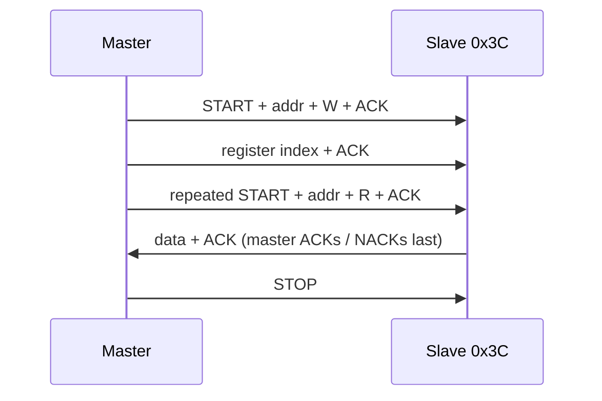

## Roadmap {.smaller}

We follow **one bus and one device** the whole way: the ELEGOO **SSD1306** OLED on
the **SG2000 / Pine64 Oz64**.

**Motivation & Protocol**

1. Why a *bus* at all — serial vs parallel
2. What I²C is for, and how it is wired
3. The protocol, frame by frame (START, address, ACK, …)

**The Platform**

4. I²C on the SG2000: DesignWare controllers and pinmux
5. The Oz64 header, and one very real pinmux trap

**The Device & The Code**

6. The SSD1306: control bytes and a 1 KB framebuffer
7. One protocol, four layers of code (C)
8. Synthesis and lab ladder

::: {.notes}
Frame the deck: I²C is a small protocol, but the interesting lessons are at the
boundaries — the electrical layer, the pinmux, and the difference between what
the kernel does for you and what you have to do yourself. Everything is anchored
on the real OLED on the desk.
:::

# Part 0 — Talking Between Chips

## The Wiring Problem {.smaller}

A CPU needs to talk to sensors, memory, converters, displays. The naive answer is
**a dedicated set of wires per device**:

```text
CPU ──────────────── sensor A      (4-8 wires)
CPU ──────────────── sensor B      (4-8 wires)
CPU ──────────────── display C     (4-8 wires)
```

Pins and PCB traces are expensive. A **bus** shares one set of wires among many
devices and relies on **addressing** to pick the listener.

::: {.fragment}
> A bus trades *wires* for *protocol*: fewer pins, but now every transfer needs
> rules about who is talking and when.
:::

::: {.notes}
This is the whole motivation. Parallel I/O and point-to-point links still exist
when you need bandwidth; buses win when you need many slow peripherals.
:::

## Parallel vs Serial {.smaller}

| | Parallel | Serial |
|---|---|---|
| Wires | one per bit (+ control) | one or two for data |
| Throughput | high (wide) | lower per edge, high per wire |
| Cost / pins | high | low |
| Skew & crosstalk | worse (many lines must stay in step) | better |
| Distance | short | longer |

::: {.fragment}
At modern clock rates, keeping 8–32 parallel lines bit-aligned is hard, so
**almost everything off-chip today is serial** — PCIe, USB, SATA, Ethernet, I²C,
SPI. "Serial" does not mean "slow".
:::

::: {.notes}
Classic teaching point: parallel was king in the 1980s, serial won as clocks
rose. I²C is the *low* end of the serial family: slow, cheap, short.
:::

## Synchronous vs Asynchronous {.smaller}

A serial link must solve one problem: **where are the bit boundaries?**

- **Asynchronous** (UART): both ends agree on a *bit rate*; each byte is framed by
  start/stop bits and the receiver re-synchronises per byte. No clock wire.
- **Synchronous** (I²C, SPI): the sender also provides a **clock**. The receiver
  samples data on a clock edge, so no baud-rate drift.

| | UART | I²C | SPI |
|---|---|---|---|
| Clock wire | no | **yes** (SCL) | yes |
| Data wires | 1 TX + 1 RX | 1 SDA | 2 (MOSI/MISO) + CS per device |
| Devices per link | 2 | many | many |
| Addressing | none | **7-bit on the wire** | chip-select wire |

::: {.fragment}
I²C's trick: **a clock *and* an address**, on two wires, shared by everyone.
:::

::: {.notes}
I²C sits between UART and SPI: synchronous like SPI, multi-drop like a bus, but
with only two wires and in-band addressing instead of one chip-select per device.
:::

## What Every Serial Protocol Must Define {.smaller}

::: {.fragment}
1. **Framing** — how do I know where a message starts and ends? (START/STOP)
2. **Addressing** — who is this for? (7-bit address + R/W)
3. **Direction** — is the master writing or reading? (R/W bit)
4. **Acknowledgment** — did the bytes land? (ACK/NACK)
5. **Speed** — how fast may I clock? (Standard/Fast/… modes)
6. **Sharing** — what if two masters talk at once? (arbitration)
7. **Stretching** — what if a slave needs more time? (clock stretching)
:::

::: {.fragment}
Keep this list. Every section of the protocol is one of these answers.
:::

::: {.notes}
This is the analytical spine of the deck. When we show a waveform, point back to
which item on this list it implements.
:::

# Part I — What I²C Is For

## I²C in One Slide {.smaller}

**Inter-Integrated Circuit** — Philips, 1982 (now NXP). Designed to connect a
processor to **slow, cheap peripherals on the same board** over **two wires**.

| Signal | Name | Role |
|---|---|---|
| **SCL** | Serial CLock | master drives the clock |
| **SDA** | Serial DAta | both directions, half-duplex |

- **Multi-drop**: many devices share the same two wires.
- **Addressed**: up to 112 usable 7-bit addresses (plus a 10-bit extension).
- **Master / slave**: the master initiates; the slave responds.
- **Typical use**: sensors, EEPROMs, RTCs, GPIO expanders, ADCs, **small OLEDs**.

::: {.notes}
I²C is not for bulk data. It is the "management plane" bus: configure a sensor,
read a register, push a framebuffer to a tiny display.
:::

## The Electrical Layer: Open-Drain + Pull-Ups {.smaller}

Both SDA and SCL are **open-drain**: a device can only pull a line **low** or
**release** it. External **pull-up resistors** bring a released line **high**.

```text
        +3V3
         │
        ┌┴┐  Rp (e.g. 4.7 k)
        │ │
        └┬┘
   ──────┴───────────── SDA
   ──────┬───────────── SCL
        └── each device:  transistor to GND, or high-Z
```

::: {.fragment}
Release = high-Z = the line is pulled high by *everyone's* resistor.
Any device pulling low wins over any number of releases — a **wired-AND**.
:::

::: {.fragment}
This is why I²C has **no contention**: two devices can never fight by driving
opposite levels on the same wire. It is also why the **idle state is high**.
:::

::: {.notes}
Open-drain is the key electrical idea. It enables shared lines and safe
multi-master operation, at the cost of pull-up-limited speed (rise time).
:::

## Multi-Drop and Addressing {.smaller}

Every slave has a **7-bit address** fixed by the chip or set by strapping pins.

| Range | Use |
|---|---|
| `0x00` | general call |
| `0x01`–`0x07` | reserved (CBUS, high-speed, …) |
| **`0x08`–`0x77`** | usable device addresses |
| `0x78`–`0x7B` | reserved (10-bit addressing) |
| `0x7C`–`0x7F` | reserved |

::: {.fragment}
Our panel is at **`0x3C`**. Its sibling address **`0x3D`** exists because one
module pin (**SA0**) shifts the address, so you can put two on one bus.
:::

::: {.notes}
Address = 7 bits on the wire, so the 8-bit byte includes the R/W bit. This is
where the famous 0x3C/0x78 confusion comes from — next slide.
:::

## The `0x3C` vs `0x78` Gotcha {.smaller}

Manuals for OLED modules often print **`0x78`**. That is *not* the bus address.
It is the **8-bit "write address"**: 7 address bits shifted left, with R/W = 0.

```text
   0x3C  = 0b011_1100            (7-bit address)
   << 1  = 0b0111_1000 = 0x78   (8-bit write frame on the wire)
```

| Where you see it | Value |
|---|---|
| Datasheet / most libraries | **7-bit `0x3C`** |
| Logic-analyser trace / "scanner" | 8-bit `0x78` (write), `0x79` (read) |

::: {.fragment}
> On the wire, `0x78` is *"address 0x3C, write"*. In code you pass the 7 bits:
> **`0x3C`**.
:::

::: {.notes}
The ELEGOO wiki calls this out explicitly. On SG2000/Linux we pass 0x3C to the
kernel and never see 0x78; on the wire it is 0x78. Same thing, different window.
:::

## I²C vs SPI vs UART {.smaller}

| | I²C | SPI | UART |
|---|---|---|---|
| Wires (n devices) | **2** | 3 + n chip-selects | 2 per link |
| Addressing | in-band (7-bit) | chip-select wire | none (point-to-point) |
| Duplex | half | full | full |
| Speed | 100 k–3.4 M | 10–100 M | fixed pair rate |
| Multi-master | yes | no | no |
| Best for | many slow chips, few pins | fast, few chips | two-chip links, consoles |

::: {.fragment}
Pick I²C when **pins are scarce** and devices are **slow**. Pick SPI when you
need **speed**. Pick UART when you need **two devices, simply**.
:::

::: {.notes}
Note SPI's chip-select scaling: 4 wires + 1 per device. I²C scales to *zero*
extra wires per device. That is its entire reason to exist.
:::

# Part II — The Protocol

## Idle, START, and STOP {.smaller}

A message is bracketed by two conditions that **cannot occur during normal data
transfer** — SDA may only change while SCL is low:

```text
       idle        START             data …            STOP        idle
 SCL: ─────┐         ┌─────┐   ┌─────┐        ┌─────┐         ┌─────
           └─────────┘     └───┘     └────────┘     └────┐    ┘
 SDA: ───────┐   ┌─────┐   ┌─────┐        ┌───────────────┐
             └───┘     └───┘     └────────┘               └───
            ▼ high while     (data changes only while SCL low)   ▲
       SDA falls while SCL high                          SDA rises while SCL high
```

- **START**: SDA falls **while SCL is high**.
- **STOP**: SDA rises **while SCL is high**.

::: {.notes}
The rule "SDA changes only when SCL is low" is what makes START/STOP unique. The
first edge after idle is always START; the transfer ends with STOP (or a repeated
START).
:::

## A Byte on the Wire {.smaller}

After START, data goes **one byte at a time, MSB first**, with an **ACK slot**:

```text
 SCL: ─┐ ┌─┐ ┌─┐ ┌─┐ ┌─┐ ┌─┐ ┌─┐ ┌─┐ ┌─┐ ┌─
       └─┘ └─┘ └─┘ └─┘ └─┘ └─┘ └─┘ └─┘ └─┘
 SDA:  b7   b6   b5   b4   b3   b2   b1   b0   ACK
```

- 8 data clocks + **1 ACK clock** = 9 clocks per byte.
- The **transmitter releases SDA** for the 9th clock; the **receiver pulls it low**
  to say "got it".
- Sampling happens on the **rising edge** of SCL (data is stable while SCL high).

::: {.fragment}
**ACK** = receiver pulls SDA low on the 9th clock. **NACK** = it releases SDA
(high). A master NACKs the last read byte to say "stop sending".
:::

::: {.notes}
Spell out the roles: for an address byte the receiver is the slave; for a data
byte the receiver is whoever is not transmitting.
:::

## The Address Frame {.smaller}

Every transfer begins with an **address/R‑W byte**:

```text
   ┌───┬─────────────┬───┬─────┐
   │ S │ A6 … A0     │R/W│ ACK │      1  byte, MSB first
   └───┴─────────────┴───┴─────┘
    7 address bits     0 = write
                       1 = read
```

- Write to our panel: `0x3C << 1 | 0` = **`0x78`** on the wire.
- The addressed slave **ACKs**; everyone else stays quiet.

::: {.fragment}
> The **first byte of every I²C transaction is addressing**. There is no separate
> "select" wire — the address *is* the select, and it is the same 9-bit frame
> shape as data.
:::

::: {.notes}
This is the heart of I²C: addressing and data share the same serial frame. A
listener decodes the first byte; if it is not its address, it ignores the rest
until the next START.
:::

## Data Transfer and ACK/NACK {.smaller}

```text
 [S][addr 7b][W][A] [data0][A] [data1][A] [data2][A] [P]
                  ▲                       
                  slave ACKs each byte it accepts
```

- The **receiver** of each byte (slave on writes, master on reads) drives ACK.
- A **NACK** lets a master end a read: it ACKs every byte it wants and NACKs the
  final one, then issues STOP.
- The SSD1306 ACKs every byte, so a missing ACK is a wiring/address fault.

::: {.notes}
Tie back to the code: a "write" that returns non-zero from the controller is
usually "the address NACKed" — i.e. nothing answered at 0x3C. That was exactly
the symptom in our pinmux story.
:::

## Repeated START and Register Access {.smaller}

Many devices (and the SSD1306's cousins) use a **register pointer**: write the
register index, then read. That needs a direction change **without** dropping the
bus — a **repeated START** instead of STOP+START.



::: {.notes}
The SSD1306 is write-only in practice: you stream command/data bytes and never
read back. But the repeated-START pattern is the general case and worth showing,
because it is how most sensors work.
:::

## Clock Stretching {.smaller}

The clock is nominally the master's, but a slave may **hold SCL low** to buy
time. The master must **wait** and not start the next high phase.

```text
 SCL: ────┐        ┌──────────────┐     ┌────
          └────────┘              └─────┘
                  ▲
                  slave is not ready -> holds SCL low
```

- Why: a slow ADC needs to convert; an EEPROM needs to erase a page.
- Cost: it makes the transfer **non-deterministic** (bounded by the slowest
  slave).
- Implemented correctly, the master's SCL timing must be **open-drain too** (it
  releases the clock high, it does not drive it high).

::: {.fragment}
> Clock stretching is the electrical layer showing through the protocol: because
> the clock line is open-drain, "the master owns the clock" is only *mostly*
> true.
:::

::: {.notes}
This is why you cannot bit-bang SCL by driving it high push-pull: a stretching
slave would be shorted. Release it and read it back. Our bit-bang does this.
:::

## Multi-Master Arbitration {.smaller}

I²C allows several masters. They may start together; **wired-AND** resolves it
without damage:

```text
 Master 1 sends: 1 0 1 1 0 …
 Master 2 sends: 1 0 0 …
   SDA becomes: 1 0 0 (low wins)
                    ▲ Master 2 pulled low; Master 1 sees 0 but sent 1
                      -> Master 1 loses arbitration, backs off silently
```

- Every transmitter **reads SDA back** and compares with what it sent.
- A mismatch = **loss of arbitration**: stop driving SDA, keep listening, try
  again later.
- The winning master never even notices.

::: {.notes}
Arbitration only works because SDA is open-drain and the "low wins" rule is
universal. This is a clean example of the electrical layer enabling a protocol
feature.
:::

## Protocol, Recapped {.smaller}

| Layer | Rule | Why it exists |
|---|---|---|
| Electrical | open-drain + pull-ups, idle high | share wires safely |
| Framing | START / STOP (SDA edges while SCL high) | mark message boundaries |
| Addressing | 7-bit address + R/W, first byte | pick a listener, in-band |
| Data | MSB first, 9 clocks/byte, ACK | reliable byte transfer |
| Direction | repeated START | change master/slave without losing the bus |
| Time | clock stretching | let slow slaves keep up |
| Sharing | arbitration | many masters, no corruption |

::: {.fragment}
Every property is a direct consequence of the **electrical layer**.
:::

::: {.notes}
This table is the answer key to the "what must a serial protocol define" list
from Part 0. Close Part II here.
:::

# Part III — I²C on the SG2000

## Five Controllers, One Register Map {.smaller}

The SG2000 has five I²C controllers, all **Synopsys DesignWare** (`snps,designware-i2c`):

| Linux | Base | Pins (typical) | Notes |
|---|---|---|---|
| `i2c-0` | `0x04000000` | — | `disabled` in the tree |
| `i2c-1` | `0x04010000` | header, varies by board | |
| `i2c-2` | `0x04020000` | header / camera | |
| `i2c-3` | `0x04030000` | **Oz64 header pin 3/5** | our bus |
| `i2c-4` | `0x04040000` | DSI touch, header on Duo S | has `gt9xx@14` |

Key registers (same layout on every instance):

| Offset | Name | Purpose |
|---|---|---|
| `0x00` | `IC_CON` | master/slave, speed, restart, slave-disable |
| `0x04` | `IC_TAR` | target (slave) address |
| `0x10` | `IC_DATA_CMD` | push a byte; bit 9 = STOP, bit 8 = read |
| `0x6C` | `IC_ENABLE` | enable/disable the block |
| `0x70` | `IC_STATUS` | TX FIFO not full, master-active, … |
| `0x80` | `IC_TX_ABRT_SOURCE` | why the last transaction aborted |

::: {.notes}
This is the register-level view we will actually program from userspace on the
Linux side (mmap) and for the FreeRTOS example. The kernel's i2c-dev hides all of
it; the raw layer does not.
:::

## The Linux View {.smaller}

The kernel's `i2c_designware` driver claims each controller and exposes it as a
**character device**, plus a sysfs device per attached chip.

```bash
ls -l /dev/i2c-*                      # /dev/i2c-1 .. /dev/i2c-4
i2cdetect -l                          # adapter list
i2cdetect -y -r 3                     # scan bus 3 for ACKing addresses
#      0  1  2  3  4  5  6  7  8  9  a  b  c  d  e  f
# 30: -- -- -- -- -- -- -- -- -- -- -- -- 3c -- -- --
```

- Address a chip with `ioctl(fd, I2C_SLAVE, 0x3C)`, then `write()`/`read()`.
- `-r` uses a **read** probe; some devices only ACK a **quick write** (`-y`).
- On this Debian image `i2c-tools` lives in `/usr/sbin`, not `/usr/bin`.

::: {.fragment}
> `i2cdetect` is the first thing to run, and the fastest way to tell **pinmux**
> from **wiring** from **address** problems. No `3c` = nothing is answering.
:::

::: {.notes}
Mention that the `debian` user needs the `i2c` group (or root) to open
/dev/i2c-*; we added it during bring-up.
:::

## Pinmux vs Controller {.smaller}

Two separate blocks decide whether I²C works, and mixing them up is the #1 source
of confusion:

1. **Pinmux / I/O controller** (`0x03001000`): which *function* drives each **pad**
   (GPIO, UART, SPI, IIC…). Tools: `cvi-pinmux`, `duo-pinmux` (write via `/dev/mem`).
2. **I²C controller** (`0x04030000` for IIC3): the protocol engine (shift, ACK,
   START/STOP). Managed by the kernel driver.

```text
 SoC I²C3 engine ──► pad mux ──► XGPIOB[20]/[21] ──► header pin 3/5 ──► OLED
        0x04030000   0x03001158/5c
```

::: {.fragment}
A controller can be **enabled** and a bus can be **working** — and still not reach
a pin, because the **pad** is muxed to something else. That is not a bug; it is
the design.
:::

::: {.notes}
This sets up the Oz64 trap two slides later. On SG2000 the FSBL does the initial
pinmux at boot, from its own configuration — the Linux DT does not control it.
:::

## The Oz64 Header {.smaller}

The 26‑pin "GPIO" header (`J47`, "14 Pi‑2 connector"). The connector symbol's
printed names are generic Raspberry‑Pi names — **ignore them**; the real nets are
the `XGPIOB*` ones.

| Header pin | SoC pad | IIC3 function | IIC4 function |
|---|---|---|---|
| 1 | — | 3V3 | 3V3 |
| **3** | `XGPIOB[20]` (`VIVO_D1`) | **IIC3_SDA** | IIC4_SCL |
| **5** | `XGPIOB[21]` (`VIVO_D0`) | **IIC3_SCL** | IIC4_SDA |
| 7 | `XGPIOB[18]` | — | — |
| 9 | — | GND | GND |

So our OLED is on **IIC3**: pin 3 = SDA, pin 5 = SCL → **`/dev/i2c-3`**, addr `0x3C`.

::: {.notes}
The `I2C1_SDA`/`I2C1_SCL` text printed inside the connector symbol is a lie — it
is just the reused RPi symbol's pin name. Always trace nets, not symbol labels.
:::

## The Trap: Enabled ≠ Routed {.smaller}

At boot, the FSBL muxed **IIC3 to pads A5/A6** (not on the header). The controller
was "enabled". The OLED did nothing.

```bash
# what it looked like: IIC3 already active -- on the wrong pads
cvi-pinmux -l | grep -A1 'IIC3_SCL function'
# IIC3_SCL function:
# [v] IIC3_SCL            <- pad A5, nowhere near the header
```

The fix is to **free A5/A6** and route IIC3 to the header pads:

```bash
sudo cvi-pinmux -w IIC3_SCL/XGPIOA_5      # release the default pads
sudo cvi-pinmux -w IIC3_SDA/XGPIOA_6
sudo duo-pinmux -w B20/IIC3_SDA           # header pin 3 = SDA
sudo duo-pinmux -w B21/IIC3_SCL           # header pin 5 = SCL

i2cdetect -y -r 3
# 30: -- -- -- -- -- -- -- -- -- -- -- -- 3c -- -- --   <- there it is
```

::: {.fragment}
> **Two pad groups driving one controller is worse than none.** Both muxed = the
> bus does not work. Freeing the default pads fixed it, not "enabling IIC3".
:::

::: {.notes}
This is the real debugging story from the desk. It is a great exam question:
"the controller was enabled, why didn't it work?" Answer: pinmux is a separate
block. Our earlier bit-bang scan *also* failed, which proved it was not the
controller.
:::

## Ownership: Big Core vs Little Core {.smaller}

The same IIC3 pads can be driven by either core, but not both at once:

| | Big core (C906/C920) | Little core (C906L) |
|---|---|---|
| Runs | Linux | bare-metal / FreeRTOS |
| Access | `/dev/i2c-3`, kernel driver | direct MMIO to `0x04030000` |
| Pinmux | `cvi-pinmux` / `duo-pinmux` | writes the pad regs itself |
| Clock | kernel runtime-PM manages it | **you must ungate it** |

::: {.fragment}
On the Oz64 image we have, the little core is **not** exposed via `remoteproc`
(the DTB has no `cv181x-c906_1` node, only `rtos_cmdqu`) — so the Arduino/FreeRTOS
rungs build but cannot be loaded here. We mark them accordingly.
:::

::: {.notes}
This is an honest platform caveat. The DuoS image in the hints *does* have
remoteproc; the Oz64 image does not. Same SoC, different board image.
:::

## Surprise: Userspace Cannot Just Poke the Controller {.smaller}

Trying to mmap `0x04030000` from Linux and drive the registers directly:

```text
timeout: off=0x70 status=0x00000000 (controller gated?)
```

`IC_STATUS` reads `0` — because the kernel driver **runtime‑gates the block's
clock** when idle. The register file is dark until something wakes the controller.

::: {.fragment}
Consequences:

- **Userspace raw registers** need the clock ungated → either ask the kernel
  (i2c-dev) or **bit-bang GPIO** (the GPIO block's clock is always on).
- **The little core** must ungate the IIC clock itself before its raw driver runs.

> "The hardware is memory-mapped" is necessary, not sufficient — the clock is
> part of the interface.
:::

::: {.notes}
We verified this on the dock: with the driver bound, raw IC_STATUS reads 0. This
is why the Linux raw rung we ship is a GPIO bit-bang, and why the FreeRTOS
DesignWare driver includes an `i2c_clock_enable()` step.
:::

# Part IV — The Device: SSD1306

## The Panel {.smaller}

| Property | Value |
|---|---|
| Controller | **SSD1306** (Solomon) |
| Resolution | 128 × 64, 1 bpp mono |
| Interface | I²C (4 pins: GND, VCC, SCL, SDA) |
| Address | **`0x3C`** 7-bit (`0x78` on the wire) |
| Logic level | 3.3 V (VCC 3.3–5 V on the module) |
| RAM (GDDRAM) | 128 × 64 bits = **1024 bytes** |

::: {.fragment}
It is a **write-mostly** device: you send a command stream and a framebuffer. There
is no register read-back you need.
:::

::: {.notes}
The SSD1306's I2C frame adds one thing on top of plain I²C: a **control byte**
before the payload that says "this is a command" or "this is display data".
:::

## Control Bytes: `0x00` and `0x40` {.smaller}

After the address+W byte, the **first byte** of every transaction is a control byte:

```text
  I²C frame:  [S][0x78][ 0x00 ][ cmd bytes … ][P]     command stream (Co=0,D/C#=0)
              [S][0x78][ 0x40 ][ data bytes… ][P]     GDDRAM data   (Co=0,D/C#=1)
```

| Control byte | Meaning |
|---|---|
| `0x00` | following bytes are **commands** |
| `0x40` | following bytes are **pixel data** |

So the "transport" for our OLED is trivially thin:

```c
static void oled_cb(void *ctx, const uint8_t *buf, size_t n, int is_data) {
    uint8_t ctrl = is_data ? 0x40 : 0x00;   /* one byte before the payload */
    i2c_write(ctx, ctrl, buf, n);           /* START, 0x78, ctrl, buf…, STOP */
}
```

::: {.notes}
This is the entire device-specific layer. Everything above it is a normal I²C
write; everything below it is a normal I²C master.
:::

## Init: A Fixed Command Sequence {.smaller}

```c
static const uint8_t OLED_INIT[] = {
    0xAE,        /* display off            */
    0xD5, 0x80,  /* clock divide / osc     */
    0xA8, 0x3F,  /* multiplex ratio = 64   */
    0xD3, 0x00,  /* display offset 0       */
    0x40,        /* start line 0           */
    0x8D, 0x14,  /* charge pump on         */
    0x20, 0x00,  /* memory mode = horizontal */
    0xA1,        /* segment remap          */
    0xC8,        /* COM scan remapped      */
    0xDA, 0x12,  /* COM pins config        */
    0x81, 0xCF,  /* contrast               */
    0xD9, 0xF1,  /* pre-charge             */
    0xDB, 0x40,  /* VCOMH deselect         */
    0xA4, 0xA6, 0x2E, 0xAF,
};
```

Sent once as a single `0x00`-prefixed write. Same bytes on every platform.

::: {.notes}
No magic: it is a literal sequence from the datasheet's recommended power-on
flow. The one that matters most is 0x8D/0x14 — the charge pump that powers the
panel from 3.3 V.
:::

## GDDRAM: 8 Pages of 128 Columns {.smaller}

The RAM is organised **column-major within 8 pages**, each page 8 pixels tall:

```text
 page 0  [ col0 col1 col2 … col127 ]   each byte = 8 vertical pixels
 page 1  [ …                        ]   bit0 = top of page
 …
 page 7  [ …                        ]
```

In **horizontal addressing mode** (`0x20 0x00`), after each byte the column
pointer auto-increments and wraps to the next page — so you can stream all 1024
bytes in one go.

::: {.fragment}
To show a frame:

1. set the address window: `0x21 0 127` (columns), `0x22 0 7` (pages)
2. stream **1024 bytes** of `0x40` data

That is exactly `oled_flush()`.
:::

::: {.notes}
This layout is why 1 bpp framebuffer code uses `fb[x + (y/8)*128]`. Our shared
layer draws into a 1024-byte array and flushes it.
:::

# Part V — One Protocol, Four Layers

## The Ladder {.smaller}

Same bus, same device, same protocol — different **who** and **how safely**:

| Rung | Runs on | Mechanism | Safety | Status |
|---|---|---|---|---|
| `i2c-dev` | Linux userspace | kernel driver, `/dev/i2c-3` | arbitrated | **verified** |
| raw mmap | Linux userspace | bit-bang B20/B21 via `/dev/mem` | none | **verified** |
| Arduino (bit-bang) | little C906L | direct MMIO, no OS | none | **built** |
| Arduino (`Wire`) | little C906L | vendor `csi_iic` | none | reasoned |
| FreeRTOS (DesignWare) | little C906L | MMIO to `0x04030000` + task | none | reasoned |
| FreeRTOS (bit-bang) | little C906L | MMIO bit-bang + task | none | reasoned |

::: {.fragment}
The abstraction changes **who writes the registers and how safely**, not what the
hardware does. `i2c-dev` and a bit-bang end with the same `0x78` on the wire.
:::

::: {.notes}
|Status legend: **verified** = ran on the Oz64 and the panel refreshed;
**built** = cross-compiled for the target but blocked by the image's missing
remoteproc; **reasoned** = teaching code, not executed.
:::

## The Shared Layer (Platform-Independent) {.smaller}

`examples/i2c-c/ssd1306.h` knows the SSD1306 and **nothing about the transport**:

```c
typedef void (*oled_write_fn)(void *ctx, const uint8_t *buf, size_t len,
                              int is_data);

static inline void oled_init (oled_t *o, oled_write_fn w, void *ctx);  /* 0x00 cmds */
static inline void oled_flush(oled_t *o);      /* window + 1024 bytes @ 0x40 */
/* drawing: oled_clear, oled_pixel, oled_text, oled_draw_lines */
```

Every rung below supplies a different `oled_write_fn`. The **upper** half of the
code is byte-for-byte identical on Linux and on the little core.

::: {.fragment}
> Good driver layering: the device logic is transport-agnostic; the transport is
> device-agnostic. Only the thin middle changes.
:::

::: {.notes}
This is the "portable code" lesson from the OS deck, made concrete: the same
header compiles into a Linux binary and a bare-metal sketch.
:::

## Rung 1 — Linux `i2c-dev` {.smaller}

`examples/i2c-c/linux-i2c-dev.c` (**verified**):

```c
int fd = open("/dev/i2c-3", O_RDWR);
ioctl(fd, I2C_SLAVE, OLED_ADDR);              /* 0x3C */

static void i2c_write_cb(void *ctx, const uint8_t *buf, size_t len,
                         int is_data) {
    uint8_t chunk[1 + 32];
    for (size_t off = 0; off < len; off += 32) {
        size_t n = len - off; if (n > 32) n = 32;
        chunk[0] = is_data ? 0x40 : 0x00;     /* the SSD1306 control byte */
        memcpy(chunk + 1, buf + off, n);
        write(fd, chunk, n + 1);              /* one I²C transaction */
    }
}
```

```bash
./linux-i2c-dev /dev/i2c-3 "Hello Oz64"
# wrote Hello Oz64 to /dev/i2c-3 @ 0x3C (i2c-dev)
```

::: {.notes}
One `write()` becomes one START…STOP transaction; the kernel does everything
else. Verified on the Oz64: the panel shows the string. This is the rung to reach
for first.
:::

## Rung 2 — Linux Raw Registers (Bit-Bang) {.smaller}

`examples/i2c-c/linux-mmap-bitbang.c` (**verified**) — no kernel I²C at all:

```c
#define MUX_BASE   0x03001000UL     /* pad function select */
#define GPIOB_BASE 0x03021000UL
#define SDA 20                      /* XGPIOB[20], pin 3 */
#define SCL 21                      /* XGPIOB[21], pin 5 */

mux[0x158/4] = (mux[0x158/4] & ~0x7u) | 3u;   /* B20 -> GPIO */
mux[0x15C/4] = (mux[0x15C/4] & ~0x7u) | 3u;   /* B21 -> GPIO */
/* open-drain: drive low = output low, release = input (pull-up wins) */
```

Then `start/stop/wbit/rbit/wbyte` on the two data/direction/input registers.
**Why bit-bang and not the IIC controller?** Because the controller's clock is
kernel-gated (previous slide); the GPIO block's is not.

::: {.fragment}
Same 1024-byte `oled_flush()`; only the transport swapped. This is `gpio-software.md`
applied to a two-wire protocol.
:::

::: {.notes}
Verified: panel refreshed, and afterwards the code restores the pads to IIC3 so
the kernel path keeps working. The bit-bang reads SDA back for ACK and releases
SCL (rather than driving it high) so clock stretching would be safe.
:::

## Rung 3 — Arduino (Little Core, Bit-Bang) {.smaller}

`examples/i2c-arduino/oled-bitbang/` (**built**, not run here). It reuses the same
`ssd1306.h` and does the same bit-bang, but in M-mode with no `/dev/mem`:

```cpp
void setup() {
    w32(MUX_B20, (r32(MUX_B20) & ~0x7u) | 3u);   /* B20 -> GPIO */
    w32(MUX_B21, (r32(MUX_B21) & ~0x7u) | 3u);   /* B21 -> GPIO */
    oled_init(&o, oled_cb, NULL);
    oled_text(&o, 0, 0, "OZ64");
    oled_text(&o, 0, 12, "I2C bit-bang");
    oled_flush(&o);
}
```

```bash
arduino-cli compile --fqbn sophgo:SG200X:duos oled-bitbang
readelf -h build/oled-bitbang.ino.elf | grep Entry
#   Entry point address: 0x9fe00000
```

::: {.notes}
It builds cleanly for the duos variant. Loading needs remoteproc, which this
Oz64 image lacks (no `cv181x-c906_1` DT node, only `rtos_cmdqu`). On a DuoS image
the same artifact loads via `/sys/class/remoteproc/remoteproc0`.
:::

## Rung 3b — Arduino `Wire` (and Why It Doesn't Fit) {.smaller}

The idiomatic sketch is `Wire4.begin(); Wire4.beginTransmission(0x3C); …`, but on
the `duos` variant it **cannot reach our OLED**:

| `Wire` instance | Bus | Pins | Usable here? |
|---|---|---|---|
| `Wire0` | IIC0 | `0xff` | no pins |
| `Wire1` | IIC1 | pins 11/13 | wrong pads |
| `Wire2` | IIC2 | pins 21/19 | wrong pads |
| **`Wire3`** | **IIC3** | **`0xff` — unimplemented** | **no** |
| `Wire4` | IIC4 | pins 5/3 | **SDA/SCL swapped vs our wiring** |

`Wire4` drives `XGPIOB[20]` as IIC4_**SCL** and `XGPIOB[21]` as IIC4_**SDA** —
the reverse of the header's pin‑3=SDA/pin‑5=SCL wiring. It would only work if the
OLED were rewired.

::: {.fragment}
> Lesson: **the same peripheral name means different pads on different boards.**
> `Wire4` is "I²C" and correct for a Duo S — and wrong for our Oz64 wiring.
:::

::: {.notes}
This is exactly the class of bug the pinmux slide warned about. We chose the
bit-bang sketch as the Arduino rung precisely because it does not depend on the
variant's I²C tables.
:::

## Rung 4 — FreeRTOS Task (DesignWare) {.smaller}

`examples/i2c-freertos/oled_task.c` (**reasoned**). A task owns the display and
**blocks** between refreshes:

```c
static void oled_task(void *arg) {
    oled_t o;
    oled_init(&o, oled_write_cb, NULL);
    for (;;) {
        oled_clear(&o);
        oled_text(&o, 0, 0, "Oz64 + FreeRTOS");
        oled_flush(&o);
        vTaskDelay(pdMS_TO_TICKS(500));   /* block, do not busy-wait */
    }
}
```

Transport is `i2c_dw_write()` — the DesignWare registers, direct MMIO — with the
two things userspace could not do: **clock enable** and **pad mux**:

```c
i2c_clock_enable();                       /* ungate the block */
mmio_wr(MUX_B20, (rd(MUX_B20)&~0x7u)|5u); /* B20 -> IIC3_SDA */
WR(IC_TAR, 0x3C); WR(IC_ENABLE, 1);
/* push bytes into IC_DATA_CMD; last byte OR'd with STOP; poll IC_STATUS */
```

::: {.notes}
The register driver is the same controller as Part III. On a real RTOS this is a
shared resource: you would guard I2C with a mutex if more than one task talks to
the bus. `vTaskDelay` makes the refresh free for other tasks.
:::

## Rung 4b — FreeRTOS Task (Bit-Bang) {.smaller}

`examples/i2c-freertos/i2c_bitbang.c` (**reasoned**). The same bit-bang as the
Arduino rung, wrapped so the task model is visible:

```c
/* choose at compile time */
#ifndef OLED_TRANSPORT_DW
#define OLED_TRANSPORT_DW 1        /* 0 = bit-bang */
#endif
```

- **No controller, no clock gating** — just GPIO registers and a busy delay.
- The **transport is validated** by the Linux bit-bang (rung 2) and the Arduino
  sketch (rung 3): identical sequence, identical output.
- Timing uses a **busy loop** for the 5 µs half-period, because an RTOS tick is
  far too coarse for the bit edges.

> Two transports, one `oled_flush()`: register engine when the clock is yours;
> bit-bang when it is not.

::: {.notes}
A common real-world choice: if the vendor driver is unavailable or the clock is
owned elsewhere, bit-bang the two pins. It costs CPU and timing precision but has
zero dependencies.
:::

## Verified vs Reasoned: The Scoreboard {.smaller}

| Artifact | Builds | Runs on Oz64 | Evidence |
|---|---|---|---|
| `linux-i2c-dev.c` | ✅ riscv64 | ✅ | `3c` found; panel shows text |
| `linux-mmap-bitbang.c` | ✅ riscv64 | ✅ | panel flushed; pads restored |
| raw controller mmap | ✅ | ❌ | `IC_STATUS`=0 (clock gated) |
| `oled-bitbang.ino` | ✅ `duos` | ⚠️ blocked | entry `0x9fe00000`; no remoteproc on image |
| `Wire4` sketch | — | ❌ by design | IIC4 pads swapped vs wiring |
| FreeRTOS (both) | — | not attempted | reasoned; clock-enable documented |

::: {.fragment}
> In this course: **say which is which.** A verified artifact has a command and an
> observed result; a reasoned one is a hypothesis with the reasoning shown.
:::

::: {.notes}
This slide is the honesty layer. The platform surprises (clock gating, missing
remoteproc, Wire mapping) are findings, not failures — and they are the most
transferable lessons in the deck.
:::

# Part VI — Synthesis & Lab

## What We Actually Learned {.smaller}

- A **bus** trades wires for protocol; I²C does it with **two**.
- **Open-drain + pull-ups** is the foundation: wired-AND, idle-high, no
  contention, arbitration, and clock stretching all follow from it.
- The frame is always **`[START][addr+R/W][ACK][data][ACK]…[STOP]`**; the address
  *is* the select.
- On the SG2000, **controller ≠ pin**. Enabling IIC3 did nothing until the pads
  were routed; two pad groups on one controller was worse than none.
- The block is **clock-gated** when idle, so "memory-mapped" is not the same as
  "accessible from userspace".
- One **transport-agnostic** driver layer drives the OLED from Linux, bare-metal,
  or an RTOS; only the thin middle changes.

::: {.notes}
Close the arc. The most exam-worthy items: the pinmux trap, the clock-gating
surprise, and the layered driver argument.
:::

## Lab Ladder & Discussion {.smaller}

**Lab ladder** (climb it on the Oz64):

1. `i2cdetect -y -r 3` → find `3c`; explain why `-r` and `-y` differ.
2. `./linux-i2c-dev /dev/i2c-3 "your text"`; then read `ssd1306.h` and change it.
3. `./linux-mmap-bitbang "…"`; compare with the i2c-dev run on an analyser.
4. Break the pinmux (`duo-pinmux -w B20/B20`) and predict the failure mode.
5. (DuoS image) build the Arduino sketch, load via remoteproc, watch the panel.

::: {.fragment}
**Discuss:**

- Why must SDA change only while SCL is low? What breaks if it doesn't?
- Why is the clock line open-drain even though the master "owns" it?
- When is bit-banging the *right* engineering choice, not a hack?
- Where should the OLED driver layer stop and the transport layer begin?
:::

::: {.notes}
End with judgment: the protocol is small; the interesting decisions are where to
put the abstraction boundary and what the platform does for you. Point at
refs.md and the `examples/` tree for the full code.
:::
